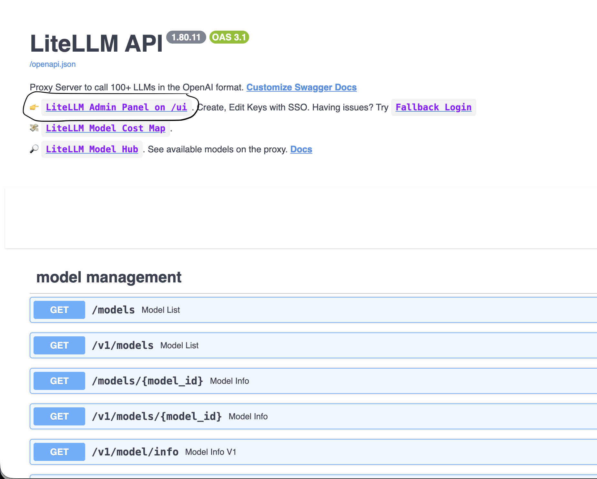
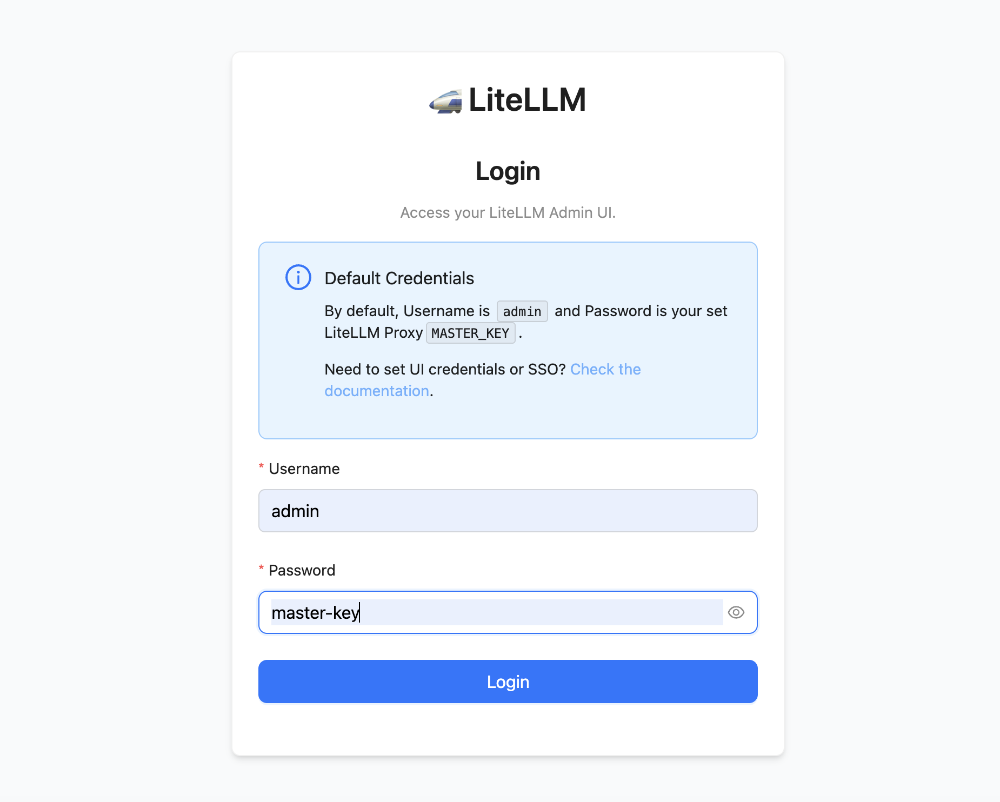

# LiteLLM Deployment Guide

## Quick Start

Deploy using the Makefile from the `litellm/` directory:

```bash
cd litellm

# Deploy everything (LiteLLM + UI + PostgreSQL)
make install

# Or deploy to a custom namespace
make install NAMESPACE=my-namespace
```

## Main Commands

| Command | Description |
|---------|-------------|
| `make install` | Build UI image and deploy all services |
| `make install-api-only` | Deploy only LiteLLM (no Streamlit UI) |
| `make uninstall` | Remove the deployment |
| `make upgrade` | Apply configuration changes |
| `make status` | Show deployment status |
| `make logs` | View logs for all services |
| `make urls` | Display service URLs |
| `make clean` | Uninstall and delete namespace |

Run `make help` for the full list of commands.

## Accessing the UI

Once deployed, check the pods are running:

```bash
oc get pods -n litellm
```

Then get the route URLs:

```bash
oc get routes -n litellm
```

- **LiteLLM Admin UI**: `https://<litellm-route>/ui` — Access the admin panel with username `admin` and your configured `masterKey` as the password.
- **Streamlit UI**: `https://<litellm-ui-route>` — Open the custom model browser interface.

Once the deployment is complete, access the LiteLLM pod and navigate to the above URLs in your browser. You should see a screen similar to:



To access the management console, click on "LiteLLM Admin Panel UI". Log in with `admin` as the username and your `masterKey` as the password.



Once logged in, all the data is stored in the PostgreSQL database.

---

## Architecture

The deployment consists of three main components that work together:

```
┌─────────────────────────────────────────────────────────────┐
│                    OpenShift Namespace                       │
│                                                              │
│  ┌──────────────┐    ┌──────────────┐    ┌──────────────┐   │
│  │   LiteLLM    │◄───│  Streamlit   │    │  PostgreSQL  │   │
│  │   Proxy      │    │     UI       │    │  (pgvector)  │   │
│  │  Port 4000   │    │  Port 8501   │    │  Port 5432   │   │
│  └──────┬───────┘    └──────────────┘    └──────▲───────┘   │
│         │                                       │            │
│         └───────────────────────────────────────┘            │
│                      DATABASE_URL                            │
└─────────────────────────────────────────────────────────────┘
```

**Data Flow:**
1. **Streamlit UI** calls the LiteLLM API to fetch and display available models
2. **LiteLLM Proxy** handles all LLM requests and stores metadata in PostgreSQL
3. **PostgreSQL** persists API keys, teams, budgets, and usage logs

---

## PostgreSQL Database (pgvector)

The PostgreSQL database is the backbone for LiteLLM's enterprise features. Without it, LiteLLM runs in stateless mode with limited functionality.

### What Gets Stored

| Data | Description |
|------|-------------|
| **Virtual API Keys** | Generated keys for users/applications to access the proxy |
| **Teams & Users** | Organization structure with assigned members |
| **Budgets** | Spending limits per user, team, or API key |
| **Spend Logs** | Usage tracking and cost attribution |
| **Model Access** | Which keys/teams can access which models |

### Database Configuration

The database connection is configured in `helm/values.yaml`:

```yaml
pgvector:
  enabled: true
  secret:
    user: postgres
    password: litellm_password  # Change in production!
    dbname: litellm
    host: pgvector
    port: "5432"
```

LiteLLM connects using the `DATABASE_URL` environment variable, which is automatically constructed from these values.

### Disabling the Database

For simple testing without persistence:

```yaml
pgvector:
  enabled: false
```

> **Note:** Without a database, virtual keys, spend tracking, and team management will not be available.

---

## Streamlit UI

The Streamlit UI is a custom web application that provides a simple interface to browse models available through the LiteLLM proxy.

### How It Works

1. **Connects to LiteLLM** — The UI is configured to call `http://litellm:4000` (internal service DNS)
2. **Fetches Models** — Calls the `/models` endpoint to retrieve available LLMs
3. **Displays Results** — Shows model information in a user-friendly format

### Environment Variables

The UI receives these from the Helm deployment:

| Variable | Purpose |
|----------|---------|
| `LITELLM_URL` | Internal URL to the LiteLLM service |
| `LITELLM_API_KEY` | API key for authenticated requests |
| `LITELLM_MASTER_KEY` | Master key for admin operations |

### Customizing the UI

The UI source code is in `apps/ui/main.py`. To modify it:

```bash
# Edit the code
cd apps/ui
vim main.py

# Rebuild the image
oc start-build litellm-ui --from-dir=. --follow -n litellm

# Restart the deployment
oc rollout restart deployment/litellm-ui -n litellm
```

---

## Configuration

Edit `helm/values.yaml` to customize models, credentials, and settings, then run:

```bash
make upgrade
```

### Key Configuration Options

```yaml
litellm:
  masterKey: "your-secure-key"    # Admin UI password
  apiKey: "sk-your-api-key"       # API access key
  config:
    model_list:
      - model_name: llama3
        litellm_params:
          model: ollama/llama3
          api_base: http://ollama:11434
```

---

## Troubleshooting

### Check Pod Status
```bash
oc get pods -n litellm
oc describe pod <pod-name> -n litellm
```

### View Logs
```bash
make logs          # All services
make logs-api      # LiteLLM only
make logs-ui       # Streamlit UI only
```

### Test Database Connection
```bash
oc exec -it deployment/litellm -n litellm -- env | grep DATABASE
```
